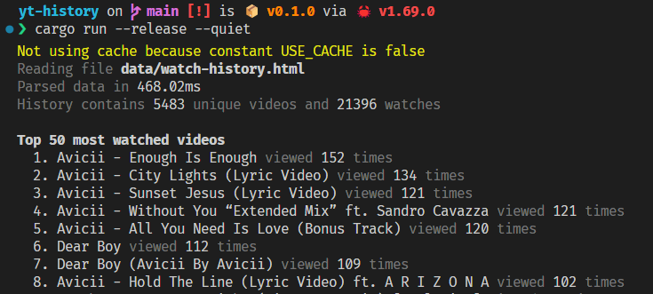

# YouTube History

This is a Rust CLI for parsing YouTube History files. It's not super useful right now, I mostly wrote it to practice Rust.



## Usage

1. Clone the repo:

   ```
   git clone git@github.com:SidneyNemzer/yt-history.git
   ```

2. Ensure you have Rust installed: https://rustup.rs/

3. Obtain your history using Google Takeout: https://takeout.google.com/b/115187908010870154250/

   _If that link doesn't work: https://myaccount.google.com > Data & Privacy > Content saved from Google services > Download your data._

   Make sure you select **YouTube > History** (the tool only processes history data currently). Either format, HTML or JSON, can be parsed.

4. Place the unzipped HTML or JSON file in `data/`.

5. Use the tool with `cargo run`.
